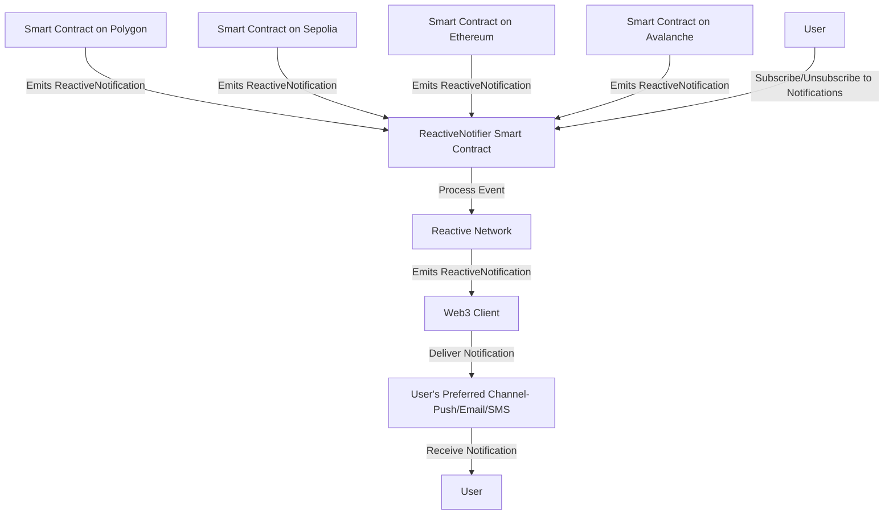

# Reactive Notifications

## Overview

The Reactive Notifications project idea is to enhance user engagement in decentralized applications (dApps) by providing real-time notifications across multiple blockchain networks. Leveraging Reactive Smart Contracts, this system allows contracts to send notifications to their users for significant events such as token transfers, liquidity updates, and contract interactions. Users can subscribe to notifications relevant to their interests, ensuring they receive timely updates to their preferred channels (e.g., email, SMS, dapp push notifications).

### Need for Reactive Notifications

In the rapidly evolving Web3 ecosystem, users often face challenges related to timely information dissemination. Traditional dApps lack mechanisms for real-time communication, leading to missed opportunities and delayed responses to essential activities. For instance, users may miss crucial events such as swap completions, token transfers, liquidity provisioning, DAO proposals, or social interactions (e.g., Farcaster posts). Real-time notifications empower users to stay informed about critical events related to their assets and activities. For instance, notifications can alert users to the completion of token swaps, updates on liquidity pools, or significant actions within decentralized autonomous organizations (DAOs). By bridging the communication gap in decentralized systems, Reactive Notifications enhance user engagement and provide a seamless user experience.

### Key Features

- **Realtime Updates**: Provide users with real-time updates about their activities(activities within contract), transactions, balances across multiple chains.

- **Subscription control:** Users can subscribe/unsubscribe from notifications at any time.

- **Token Transfer Tracking:** Subscribe to incoming/outgoing ERC20 transfers and transactions of an address and get notified in real-time through email(like how etherscan does), SMS, or push notifications.

- **Custom Event Subscription:** Subscribe to specific events on smart contracts (e.g., Swap completion, Liquidity provision, DAO proposals) and get notified in real-time.

### Architecture



## How it works

### 1. Event Usage and Emission:

A Smartcontract that wants to use the Reactive Notification should emit a `ReactiveNotification` event with the following signature:

```solidity
/// Contract should emit ReactiveNotification event with this signature
event ReactiveNotification(
        address indexed from,
        address indexed to,
        string title,
        string description,
        uint256 chainId,
        string cta,
        bytes data
    );

/// from - should be the address of emitting contract(address(this))
/// to - should be the user address to notify
function someFunction() external {
// function logic
// Emit ReactiveNotification event
emit ReactiveNotification(
            address(this),
            _to,
            "Swap Completed",
            "Your swap has been completed successfully",
            1,
            "https://example-cta.com",
            abi.encodePacked("swapId", "1234")
        );
}
```

### 2. Event Subscription:

Users subscribe to the `ReactiveNotification` event on their preferred chain and smartcontract they are interested in.

```solidity
// Subscribe to the `ReactiveNotification` event on a smart contract on a specific chain with the user address to notify
bytes memory payload = abi.encodeWithSignature(
            "subscribe(uint256,address,uint256,uint256,uint256,uint256)",
            chain_id, // Chain ID
            _contract, // Contract Address to subscribe
            REACTIVE_NOTIFICATION_EVENT_TOPIC_0,
            _contract, // based on `ReactiveNotification` event signature, topic1 is contract address
            msg.sender, // based on `ReactiveNotification` event signature, topic2 is user address to notify
            REACTIVE_IGNORE
        );
```

### 3. Listening and Processing:

The Reactive Smart Contract listens for the `ReactiveNotification` event on subscribed chain and contract. When the event is emitted on the subscribed contract, the Reactive Smart Contract decodes and process the event data and emits a `ReactiveNotification` on reactive network.

```solidity
function react(
        uint256 chain_id,
        address _contract,
        uint256 topic_0,
        uint256 topic_1,
        uint256 topic_2,
        uint256 topic_3,
        bytes calldata data,
        uint256 /* block_number */,
        uint256 /* op_code */
    ) external vmOnly {
        emit Event(
            chain_id,
            _contract,
            topic_0,
            topic_1,
            topic_2,
            topic_3,
            data,
            ++counter
        );
        if (topic_0 == REACTIVE_NOTIFICATION_EVENT_TOPIC_0) {
            (address from, address to, string memory title, string memory description, uint256 chainId, string memory cta, bytes memory extraData) = abi.decode(data, (address, address, string, string, uint256, string, bytes));
            emit ReactiveNotification(from, to, title, description, chainId, cta, extraData);
        }
    }
```

### 4. Notification Delivery:

A dedicated web3 client listens for the `ReactiveNotification` event on the reactive network and delivers the notification to the subscribed users via their preferred channels (e.g., email, SMS, push notifications in Dapp).

Below are few examples of how the notification can be delivered. These are just for illustration purposes and can be customized as per the requirement. Taken inspiration from various platforms like Etherscan, Superfluid, etc.


### Additional Features

- **Notifications about incoming/outgoing ERC20/ERC721 Transfers:** Users can subscribe to incoming/outgoing ERC20/ERC721 transfers of an address and get notified in real-time.

- **Notifications about incoming/outgoing transactions of an address:** Users can subscribe to incoming/outgoing transactions of an address and get notified in real-time.

- **Subscribing to specific events on a smart contract:** Users can subscribe to specific events on smart contracts (e.g., Swap, Liquidity provision, DAO proposals) and get notified in real-time.

### Further Considerations

- **Security & Privacy:** Ensure that the notification system is secure and does not leak sensitive information.

- **Spam & Phishing Protection:** Implement measures to prevent spam and phishing attacks. E.g Allow to receive notifications only from verified/approved sources/contracts.

- **Customization:** Allow users to customize their notification preferences. e.g. notification frequency, specific event/transaction types, topics etc.

## References

- [Reactive Network Documentation](https://dev.reactive.network)
- [Subscriptions Overview - Reactive Network](https://dev.reactive.network/subscriptions)
- [How Subscriptions work - Reactive Network](https://dev.reactive.network/education/module-1/how-subscriptions-work)
- [Events - Reactive Network](https://dev.reactive.network/education/module-1/how-events-work)

## Safety & Security

This is experimental software and subject to change over time.

This is a proof of concept and is not ready for production use. It is not audited and has not been tested for security. Use at your own risk. I do not give any warranties and will not be liable for any loss incurred through any use of this codebase.

## License

This project is licensed under the MIT License.
